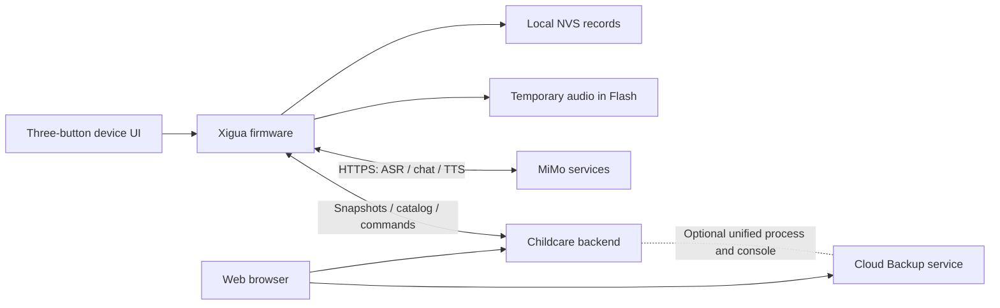

**English** · [简体中文](README.zh_CN.md)

# Xigua Assistant

A portable childcare recorder and voice assistant for **FoloToy AI Passport**.
This branch combines an offline device application, MiMo voice services, and
an optional web workspace for records, statistics, audio and caregiver handoff.
It targets personal use with one child and one device.

**Application branch:** `feature/xigua-childcare`

**Hardware:** ESP32-C3 · 8 MB Flash · no PSRAM · 240 × 320 display · three buttons

**Firmware toolchain:** ESP-IDF 5.5.3

The project is under development. Microphone-to-visible-answer Q&A has worked
on tested firmware, but the latest Story speech path still needs audible
device acceptance. Device/web statistics consistency and sustained memory
headroom remain open acceptance items.

[Current handoff](docs/assets/xigua-project-handoff.md) ·
[Resource budget](docs/assets/xigua-memory-budget.md) ·
[Backend](backend/README.md) · [Documentation](docs/README.md)

## What the application contains

| Area | Implemented behavior | Validation boundary |
| --- | --- | --- |
| Offline records | Feeding amount/ingredient, diaper events, sleep, bath, tummy time and timers; NVS persistence and undo | Local logic and persistence have host coverage; device/cloud consistency remains pending |
| AI assistant | Hold-to-talk recording, ASR, record-aware Q&A and structured record actions; readable paged replies | Physical Q&A succeeded on prior tested images; repeated use on the current image remains pending |
| Story and reading | Separate story prompt/result ownership; automatic story speech and optional reply reading; pause, resume and cached replay | Current cache-first speech lifecycle passes host tests; actual speaker acceptance remains pending |
| Audio library | Cloud catalog for songs, educational stories, early-learning music and white noise; play/pause/resume/stop commands | Backend and control logic have tests; configured media, playback and overlap budgets need device acceptance |
| Web workspace | Records, local-calendar-day charts, recoverable deletion, CSV/JSON export, audio management and device acknowledgments | Backend integration tests pass; production deployment and device/web acceptance are separate |
| Caregiver handoff and reminders | Bounded care context, parent note, handoff view and persistent reminder actions | Host coverage exists; reminder/device flows need acceptance |
| Connectivity | Known-network reconnect, local scan/password keyboard, on-demand phone BLE provisioning, clock/network/battery status | Wi-Fi/model startup checks passed; active BLE memory and recovery remain unverified |

The home menu currently contains AI assistant, Audio library, Story, Manual
record, Today, Sleep, Wi-Fi, Settings, Caregiver handoff and Reminders.
The [UI design](docs/assets/xigua-ui-design.md) explains individual flows;
source and current acceptance evidence take precedence over older proposals.

## Three-button operation

| Context | Controls |
| --- | --- |
| Browse | UP/DOWN changes the selection; OK opens or confirms; hold DOWN returns |
| Feeding editor | UP/DOWN adjusts the amount; OK saves; opening the editor alone creates no record |
| AI assistant / Story | Hold OK to record; release OK to submit; short OK activates the highlighted action |
| Reply reader | Use the displayed page/action controls for paging, reading, pause/resume and replay |
| Wi-Fi keyboard | UP/DOWN selects keys; double UP/DOWN moves by row; use the visible type, delete and completion actions |

The screen's current hints define the action for each page. AI assistant and
Story reset the shared reader when switching modes; late results from the other
mode must not replace the current reply. Returning to the same mode can retain
its reply. Clock and battery values remain unknown when valid readings are absent.

## Device and service architecture



The device calls MiMo directly. The childcare backend stores uploaded history,
serves care context and media, and exchanges commands with the device. The
optional unified deployment mounts the existing Cloud Backup service in the
same process/console while retaining separate databases and authentication.
See the [deployment guide](backend/deploy/README.md) for that integration.

Voice recording is a 16 kHz mono WAV written to temporary Flash, with a maximum
of 60 seconds. Audio resources are released before ASR networking. Chat uploads
use bounded writes and retire the serialized request before receiving the reply.
Story speech downloads completely into an ADPCM cache, closes HTTPS and frees
download resources, then initializes PCM playback. This trades a longer initial
speech wait for lower TLS/audio overlap. Text remains readable while downloading.

The temporary partition is shared by microphone recordings and synthesized
speech. A new recording invalidates the previous speech cache; this cache is
not a permanent audio library. Incomplete or cancelled downloads are not playable.

## Records and statistics

Local records work without the server. The device retains a **32-event ring**;
revisioned snapshots and stable sequence IDs support retry, reboot and undo.
The backend retains already-uploaded history after local ring rollover. Events
overwritten before upload cannot be recovered automatically.

Daily statistics require a calibrated timestamp and matching timezone.
Unknown-time records are retained but excluded from dated totals. The device's
Today summary uses retained local records; the backend can use complete uploaded
history and split sleep intervals across midnight. Those scopes still require
end-to-end alignment and acceptance.

Web deletion archives records. Web clear also queues a device clear command;
the firmware persists the local clear before acknowledging completion, keeping
settings and an unfinished session. Production deployment of both sides and
clear/edit/restore consistency are not established by backend tests alone.
An editor's initial milk amount is a proposed input, not an existing feeding record.

## Build and run

### 1. Get this application branch

```sh
git clone --branch feature/xigua-childcare https://github.com/LezardZhang/ai-passport.git
cd ai-passport
```

For a new machine, follow [environment setup](docs/development/engineering/environment-setup.md)
and activate **ESP-IDF 5.5.3**. Firmware host tests also need a C compiler,
Python and the repository's validation dependencies.

### 2. Review application configuration

| Configuration | Location |
| --- | --- |
| Firmware defaults and partitions | `sdkconfig.defaults`, `partitions.csv` |
| Wi-Fi profiles | `main/xigua_wifi_credentials.h` |
| MiMo endpoint/models/key | `main/xigua_ai_credentials.h` |
| Backend endpoint/device token | `main/xigua_backend_config.h` |

Optional overrides use the corresponding `*_local.h` files. Tracked presets
follow the owner's policy in [AGENTS.md](AGENTS.md); local overrides are optional.
The backend console can supply device configuration. Use matching models,
endpoint and credential type, and a backend URL reachable from the device.
Do not reproduce credential values in documentation or routine logs.

### 3. Validate firmware

Run from an activated ESP-IDF shell:

```sh
idf.py --version
./tools/validate.sh --static
./tools/validate.sh
```

The complete gate runs repository checks, host tests, an isolated build from
`sdkconfig.defaults`, partition/image verification and matching debug archival.
It retains `build/FoloToy-AI-Passport-full.bin` and
`build/firmware/<image-sha256>/` with BIN, ELF, MAP and a manifest.
Use [build and test](docs/development/engineering/build-and-test.md) for incremental
commands and archive verification. A gate build does not validate a connected board.

### 4. Flash and observe

Use the verified bundle and a confirmed ESP32-C3 port. For existing records,
use compatible segmented writes that preserve NVS and the temporary data region.
The merged image is for blank-device provisioning or an intentional complete
refresh; its padding can overwrite stored data. Full-chip erase is not a
routine step. Follow [firmware layout and data preservation](docs/development/engineering/firmware-layout.md#flashing-and-stored-data).

After writing, confirm the startup ELF identity, Wi-Fi, calibrated time, a
physical microphone request, the visible reply, and audible playback separately.
Retain bounded serial evidence across retries. Match crash addresses to that
firmware's ELF. Debug artifacts may contain build-time credentials; review their
contents before sharing.

### 5. Optional backend

Use **Python 3.12** and the [backend setup](backend/README.md). The childcare
service can run separately; the [unified deployment](backend/deploy/README.md)
requires the existing Cloud Backup source and its dependencies.

With backend test dependencies installed:

```sh
python -m pytest backend/tests -q
```

For complete integrated coverage, also install the Cloud Backup dependencies
and replace the example source path below:

```sh
PYTHONPATH=/absolute/cloud-backup/src python -m pytest backend/tests -q
```

Without that dependency, integrated modules can be skipped. A skipped suite
does not validate record-clear synchronization or Cloud Backup compatibility.
Deployment must preserve existing databases, media, keys and backup versions.

## Resource constraints and remaining work

There is no PSRAM. LVGL, LCD DMA, task stacks, Wi-Fi/BLE, TLS, JSON and audio
must share internal memory; application Flash is also close to its partition
limit. Linker totals and free heap alone do not establish usable contiguous space.

Every resource change must follow the [memory rules](docs/development/engineering/memory-budget.md)
and update the [Xigua budget](docs/assets/xigua-memory-budget.md). The rules cover
allocation ownership, preparation through cleanup, permitted overlap, numeric
reserves and device stress acceptance. Complete phase arbitration and
DMA/LVGL/stack measurements remain implementation work. Preserve records and
core functions while reclaiming redundant buffers and controlling lifetimes.

Current acceptance priorities are:

1. Audible Story speech on the current cache-first firmware, including pause,
   resume and replay.
2. Consistent device/web totals and clear/edit/restore behavior across reconnects
   and local ring rollover.
3. Repeated long voice workloads, deferred cloud work and provisioning recovery
   with measured heap, contiguous-block, DMA, pool and stack margins.

### Verification snapshot — 2026-10-02

| Check | Result |
| --- | --- |
| Build | PASS: ESP-IDF 5.5.3 complete gate and merged/debug archive verification |
| Host tests | PASS: firmware host suite and 29 backend tests with Cloud Backup present |
| Device tests | Partial: prior physical Q&A and current-image startup/Wi-Fi/model self-check passed |
| Unverified | Current-image audible Story, continuous resource recovery and production device/web consistency |

The dated [handoff](docs/assets/xigua-project-handoff.md) binds individual device
results to their image/ELF identities. These results are development evidence,
not a claim that every function is ready for unattended daily use.

## Repository map

| Path | Responsibility |
| --- | --- |
| `main/` | Application UI, records, reminders, voice, Wi-Fi and service workers |
| `components/bsp/` | Display, buttons, codec/I2S, battery and shared bus drivers |
| `backend/` | Childcare API, web workspace, tests and deployment integration |
| `tests/` | Host regressions for state, protocols, ownership, audio and memory lifetimes |
| `tools/` | Repository gate, firmware verification and archive tooling |
| `assets/` | Fonts, images and other reusable assets |
| `docs/assets/` | Xigua design, current budget and handoff evidence |
| `docs/development/` | Shared engineering rules and validation workflows |
| `skills/` | Required development, setup, build, device-test and debug skills |

AI-assisted changes start with [AGENTS.md](AGENTS.md). Keep application behavior
in `main/`, reusable hardware behavior in the BSP, and pure state/protocol logic
covered by host tests. Read the [documentation index](docs/README.md) for the
relevant task rather than loading every historical guide.

This application builds on the FoloToy AI Passport platform. Its upstream
hardware-test baseline and reference demos remain useful engineering references;
this feature branch boots the Xigua application. Code uses the [MIT license](LICENSE);
bundled fonts and third-party material retain their own licenses and attribution.
