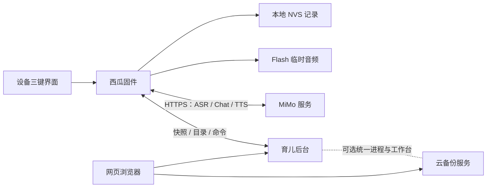

[English](README.md) · **简体中文**

# 西瓜助手

基于 **FoloToy AI Passport** 的便携育儿记录与语音助手。本分支包含可离线使用的
设备应用、MiMo 语音服务，以及可选的记录、统计、音频和照护交接网页后台。
面向单个孩子、单台设备的个人使用场景。

**应用分支：** `feature/xigua-childcare`

**硬件：** ESP32-C3 · 8 MB Flash · 无 PSRAM · 240 × 320 屏幕 · 三个按键

**固件工具链：** ESP-IDF 5.5.3

项目仍在开发中。已有受测固件完成过麦克风到屏幕回复的真实问答，但最新故事朗读
链路仍需实机发声验收。设备与网页统计一致性、持续运行的内存余量也是未完成验收项。

[当前交底](docs/assets/xigua-project-handoff.zh_CN.md) ·
[资源预算](docs/assets/xigua-memory-budget.zh_CN.md) ·
[后台说明](backend/README.zh_CN.md) · [文档索引](docs/README.zh_CN.md)

## 已有功能

| 模块 | 已实现行为 | 验证边界 |
| --- | --- | --- |
| 离线记录 | 奶量／食材、尿便、睡眠、洗澡、趴玩和计时；NVS 持久化与撤销 | 本地逻辑和持久化有主机测试；设备／云端一致性仍待验收 |
| AI 助手 | 按住说话、语音识别、结合记录问答、结构化记录操作；回复分页阅读 | 之前受测镜像的真实问答已成功；当前镜像连续使用仍待验证 |
| 故事与朗读 | 独立故事提示与结果归属；故事自动朗读、问答可选朗读；暂停、继续、缓存重播 | 当前先缓存后播放的生命周期测试通过；扬声器实际发声仍待验收 |
| 音频库 | 云端儿歌、启蒙故事、早教音乐和白噪音目录；播放／暂停／继续／停止命令 | 后台和控制逻辑有测试；实际媒体、播放及并发预算需真机验证 |
| 网页工作台 | 记录、本地日历日图表、可恢复删除、CSV／JSON 导出、音频管理和设备回执 | 后台集成测试通过；生产部署和设备／网页验收需单独完成 |
| 照护交接与提醒 | 有界育儿上下文、家长备注、交接页和持久化提醒操作 | 有主机覆盖；提醒和设备流程仍待验收 |
| 联网 | 已知网络重连、设备扫描／密码键盘、按需手机 BLE 配网、时间／网络／电量状态 | Wi-Fi／模型启动检查通过；BLE 活跃内存与关闭回收未验证 |

当前首页菜单包括 AI 助手、音频库、讲故事、手动记录、今天、睡眠、Wi-Fi 配网、
设置、照护交接和提醒。[界面设计](docs/assets/xigua-ui-design.zh_CN.md)说明各流程；
实际源码和当前验收证据优先于早期方案。

## 三键操作

| 场景 | 操作 |
| --- | --- |
| 浏览 | 上／下键切换选项；确认键进入或确认；长按下键返回 |
| 喂养编辑 | 上／下键调整数量；确认键保存；只打开编辑器不会产生记录 |
| AI 助手／讲故事 | 按住确认键录音，松开后提交；短按确认键执行当前选中动作 |
| 回复阅读 | 按屏幕提示进行翻页、朗读、暂停／继续和重播 |
| Wi-Fi 键盘 | 上／下键选择；双击上／下键按行移动；使用可见的类型切换、删除和完成操作 |

各页面以当前屏幕提示为准。问答与故事切换时重置共用阅读状态；其他模式的迟到结果
不得覆盖当前回复。返回同一模式可以保留其回复。没有有效读值时，时间和电量显示未知。

## 设备与服务架构



设备直接调用 MiMo。育儿后台保存已上传历史、提供照护上下文和媒体，并与设备交换
命令。可选统一部署把已有云备份服务挂载到同一进程／工作台，同时保留独立数据库
和鉴权。[部署指南](backend/deploy/README.zh_CN.md)说明这一集成。

录音为 16 kHz 单声道 WAV，写入临时 Flash，最长 60 秒；ASR 联网前释放音频资源。
Chat 分块上传，并在接收回复前释放序列化请求。故事语音先完整下载到 ADPCM 缓存，
关闭 HTTPS 并回收下载资源，再初始化 PCM 播放。初次发声等待更长，但减少了 TLS
与音频资源重叠；下载过程中仍可阅读文字。

录音与合成语音共用临时分区。新录音会使上一段朗读缓存失效，缓存不是永久音频库。
未完成或取消的下载不得播放。

## 记录与统计

本地记录不依赖服务器。设备保存 **32 条事件的环形记录**，使用带版本的快照和稳定
序号处理重试、重启和撤销。后台保留已上传、后来从设备环形窗口移出的历史；
上传前就被覆盖的事件无法自动找回。

每日统计需要校准时间和一致时区。时间未知的记录保留，但不计入按日期统计。
设备“今天”汇总使用仍在本地的记录；后台可以使用全部已上传历史，并按午夜拆分睡眠。
这些统计范围仍需完成端到端统一与验收。

网页删除会归档记录。网页清空还会排入设备清空命令；固件先持久化本地清空，再回报
完成，并保留设置和未结束会话。后台测试不能单独证明两端已部署，或清空／编辑／
恢复已经一致。喂养编辑器的起始奶量只是待输入值，不是已有喂奶记录。

## 构建与运行

### 1. 获取应用分支

```sh
git clone --branch feature/xigua-childcare https://github.com/LezardZhang/ai-passport.git
cd ai-passport
```

新机器先按[环境准备](docs/development/engineering/environment-setup.zh_CN.md)安装并
激活 **ESP-IDF 5.5.3**。固件主机测试还需要 C 编译器、Python 和仓库验证依赖。

### 2. 核对应用配置

| 配置 | 位置 |
| --- | --- |
| 固件默认配置与分区 | `sdkconfig.defaults`、`partitions.csv` |
| Wi-Fi 配置 | `main/xigua_wifi_credentials.h` |
| MiMo 地址／模型／密钥 | `main/xigua_ai_credentials.h` |
| 后台地址／设备令牌 | `main/xigua_backend_config.h` |

可选覆盖使用对应 `*_local.h` 文件。受 Git 管理的预设遵循 [AGENTS.md](AGENTS.zh_CN.md)
中的所有者规则；仅本机覆盖不是强制要求。后台工作台可以提供设备配置。
模型、地址和凭据类型必须匹配，后台 URL 必须能由设备访问。文档和日常日志不重复输出
凭据值。

### 3. 验证固件

在已激活的 ESP-IDF 终端中执行：

```sh
idf.py --version
./tools/validate.sh --static
./tools/validate.sh
```

完整门禁运行仓库检查、主机测试、基于 `sdkconfig.defaults` 的隔离构建、分区／镜像
验证及匹配调试归档。输出 `build/FoloToy-AI-Passport-full.bin` 和
`build/firmware/<image-sha256>/`，包含 BIN、ELF、MAP 和清单。
增量命令与归档校验见[构建与测试](docs/development/engineering/build-and-test.zh_CN.md)。
门禁构建不等于已连接板卡的验收。

### 4. 烧录与观察

使用已验证归档和确认过的 ESP32-C3 端口。保留已有记录时，采用兼容的分段写入，
保留 NVS 和临时数据区域。合并镜像适用于空设备或明确的完整刷新，其填充可能覆盖
已存数据。全片擦除不是常规步骤。遵循[固件布局与数据保留](docs/development/engineering/firmware-layout.zh_CN.md#烧录与已存数据)。

写入后，分别确认启动 ELF 身份、Wi-Fi、校准时间、实际麦克风请求、屏幕回复和实际
声音。多次重试之间持续保留有界串口证据。崩溃地址只能用该固件匹配的 ELF 解码。
调试产物可能包含构建时凭据，分享前需检查内容。

### 5. 可选后台

使用 **Python 3.12**，按[后台说明](backend/README.zh_CN.md)配置。
育儿服务可以独立运行；[统一部署](backend/deploy/README.zh_CN.md)需要已有云备份源码
及其依赖。

安装后台测试依赖后：

```sh
python -m pytest backend/tests -q
```

完整集成验证还需要安装云备份依赖，并替换下方示例源码路径：

```sh
PYTHONPATH=/absolute/cloud-backup/src python -m pytest backend/tests -q
```

缺少该依赖时，集成模块可能跳过。跳过的测试不能证明记录清空同步或云备份兼容性。
部署必须保留已有数据库、媒体、密钥和备份版本。

## 资源约束与剩余工作

本板无 PSRAM。LVGL、LCD DMA、任务栈、Wi-Fi／BLE、TLS、JSON 和音频共享内部
内存，应用 Flash 也接近分区上限。链接器总量和空闲堆读数不能单独证明适用连续块足够。

所有资源修改必须遵循[内存规则](docs/development/engineering/memory-budget.zh_CN.md)，
同步更新[西瓜预算](docs/assets/xigua-memory-budget.zh_CN.md)。规则覆盖分配归属、
准备至清理、允许的重叠、数值预留和实机压力验收。完整阶段仲裁与 DMA／LVGL／任务栈
测量仍需实现。回收重复缓冲、控制生命周期时，保留记录和核心功能。

当前验收优先项：

1. 当前先缓存后播放固件的故事实际发声，以及暂停、继续和重播。
2. 重连和本地记录环形覆盖情况下，设备／网页汇总及清空／编辑／恢复一致。
3. 连续长语音负载、延后云端工作和配网回收，测得堆、连续块、DMA、池和栈的余量。

### 验证快照——2026-10-02

| 检查 | 结果 |
| --- | --- |
| Build | PASS：ESP-IDF 5.5.3 完整门禁及合并／调试归档验证 |
| Host tests | PASS：固件主机测试及带云备份依赖的 29 项后台测试 |
| Device tests | 部分完成：之前的真实问答，以及当前镜像启动／Wi-Fi／模型自检通过 |
| Unverified | 当前镜像故事实际发声、持续资源回收及生产设备／网页一致性 |

带日期的[交底](docs/assets/xigua-project-handoff.zh_CN.md)将每轮真机结果与镜像／ELF
身份绑定。这些是开发证据，不代表所有功能已经适合无人观察的日常使用。

## 仓库结构

| 路径 | 职责 |
| --- | --- |
| `main/` | 应用界面、记录、提醒、语音、Wi-Fi 和服务工作任务 |
| `components/bsp/` | 显示、按键、codec／I2S、电量和共享总线驱动 |
| `backend/` | 育儿 API、网页工作台、测试与部署集成 |
| `tests/` | 状态、协议、所有权、音频和内存生命周期主机回归 |
| `tools/` | 仓库门禁、固件校验与归档工具 |
| `assets/` | 字体、图片和其他可复用素材 |
| `docs/assets/` | 西瓜设计、当前预算和交底证据 |
| `docs/development/` | 通用工程规则与验证流程 |
| `skills/` | 必需的开发、环境、构建、真机测试和诊断技能 |

AI 协作修改从 [AGENTS.md](AGENTS.zh_CN.md)开始。应用行为放 `main/`，可复用硬件行为
放 BSP，纯状态／协议逻辑由主机测试覆盖。通过[文档索引](docs/README.zh_CN.md)按任务
读取相关资料，无需加载全部历史指南。

本应用基于 FoloToy AI Passport 平台。上游硬件测试基线与参考 demo 可用于工程参考；
本功能分支启动的是西瓜应用。代码使用 [MIT 许可证](LICENSE)，内置字体及第三方资料
保留其各自许可证与来源说明。
