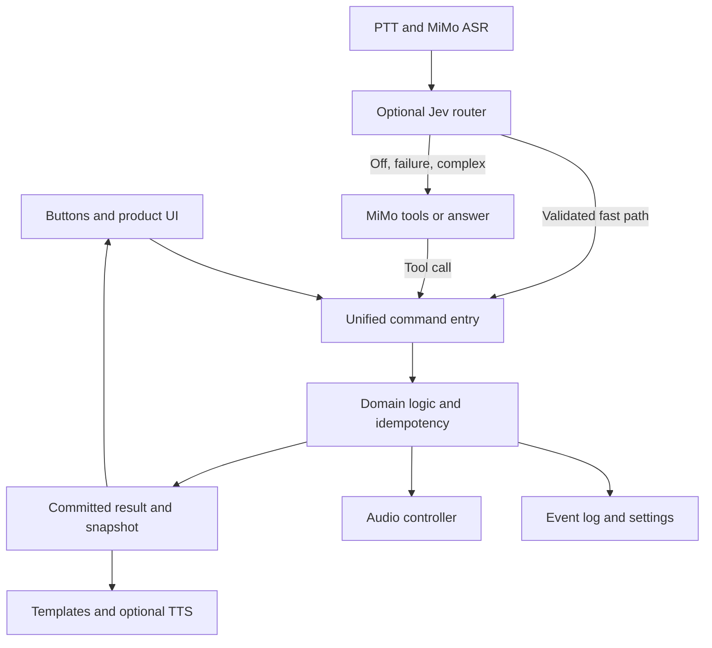

**English** · [简体中文](xigua-implementation-plan.zh_CN.md)

# Xigua Assistant implementation plan v0.4 (review draft)

Date: 2026-09-28. Target: FoloToy AI Passport, ESP32-C3, 8 MB Flash, no PSRAM, 240 x 320 portrait display, three buttons, ES8311 audio.

Build a portable childcare assistant that records facts offline and offers voice control online. Deliver a reliable local product first, add MiMo second, and enable Jev acceleration only when measurements justify it. All features belong to one firmware, booting directly into the assistant.

This is a proposal, not implemented functionality. The current request authorizes planning using the supplied pack and previous conversation. Embedded execution prompts and earlier flashing approvals do not authorize implementation, paid API calls, or flashing in this task. Numbers below are proposed budgets or acceptance targets unless explicitly described as measurements.

## 1. Evidence and starting point

- Input: `xigua_agent_solution_pack_v0.3_foundation.zip`, SHA-256 `7ea1f8e64bb9c11f455ad251030a8d65d2c8e7335d441002ce2a7b93492d8b81`. Reviewed scope, foundation, interaction, data, voice, routing, configuration, schemas, and acceptance materials.
- Experience source: the previous project introduction/quota-tool conversation, ID `01a0e5b4-bdda-7250-b11b-a02d0d24b763`. Device findings below come from that conversation; this task did not operate the device.
- Current branch `feature/quota-tool` contains uncommitted quota work. Preserve it. Reuse general lessons rather than including quota functionality by default. Future development should use a separate `feature/xigua-assistant` branch/workspace from an agreed baseline without resetting, overwriting, or silently relocating the existing changes.
- All five required Passport skills were verified available. No implementation or flashing workflow is initiated here.
- References: [specifications](../hardware-design/specifications.md), [BSP pins](../../components/bsp/include/bsp_pins.h), [development constraints](../development/ai-guide.md), and [audio resource experience](../reference/phoenixzhc/network-audio-streaming-and-memory.md). Follow repository evidence precedence: the current pin header specifies an 80 MHz LCD clock while the overview says 40 MHz; do not change drivers from overview prose.

| Evidence | Consequence for this design |
| --- | --- |
| Quota firmware was flashed; logs confirmed startup, networking, and five accounts | Reuse build verification, background networking, and UI snapshots; this does not validate voice or childcare functions |
| A black screen was reported; a later photograph confirmed a visible page | Validate real rendering separately from initialization logs; verify Chinese, backlight, physical buttons, and offline UI first |
| The user confirmed paging worked; the latest OK refresh feedback remained unconfirmed | Every command needs acknowledgment, progress, and success/failure; an empty list must still allow settings, retry, and back |
| A roughly 20.9 KB response exceeded a 16 KB buffer; increasing to 32 KB restored querying | Define bounds for each API and its parser; 32 KB is not a universal remedy |
| Windows gates were blocked by actionlint platform detection; some fixture/symlink tests failed | Repair the reproducible gate separately; firmware compilation is not Host tests PASS |
| COM6 had access/enumeration trouble before a later successful verified flash | Rediscover the target and verify image identity each time; release the port after bounded observation |
| The prototype used local build configuration for private credentials | Prefer runtime provisioning with separate settings domains; ignored source does not make the resulting binary public-safe |

## 2. Scope and releases

Keep the pack's single-child, single-device, personal-use scope. Do not introduce accounts, multi-user cloud synchronization, or a mandatory relay.

| Release | Delivered experience | Deferred |
| --- | --- | --- |
| A: local product | Chinese UI, buttons, bottle/sleep/diaper/bath/tummy/timer, today, corrections/undo, settings, time quality, Wi-Fi management, three local sounds | Voice interpretation and cloud audio |
| B: voice product | MiMo voice control over the same capabilities, short solid-food notes, general questions, spoken responses | Jev direct execution |
| C: routing optimization | Jev off/shadow/active with per-skill measurement | Calling Jev alone is not completion |
| D: optional extensions | Cloud audio manifest/streaming; later NAS/Hermes asynchronous summaries | Does not block A/B/C |

The full target retains multi-home Wi-Fi, automatic/manual timezones, and restart recovery. Deliver A through small internal milestones rather than one large foundation merge.

Excluded: breastfeeding side timers, soothing routines, bath countdowns, diagnosis from crying, cameras, local LLMs, Hermes in the real-time path, and first-release OTA. General answers do not modify records; no diagnostic tool or automatic medical action is exposed.

## 3. Experience and buttons

Use seven cards: overview, feeding, sleep, diaper, sounds, today, more. More contains solid food, bath, tummy, timer, Wi-Fi, and settings. Overview emphasizes last feeding, active sleep/timer, and today's summary with large text.

```text
13:42       Online        82%

Last bottle
150 ml at 11:28
2 h 14 min ago

Sleeping  00:47

UP/DOWN cards   OK today
Hold OK to speak
```

This illustrates content rather than validated 240 x 320 typography. Unknown time is `--:--`; unavailable battery reads remain unknown. Do not infer charging from increasing state of charge.

| Input | Behavior |
| --- | --- |
| UP / DOWN click | Change card/selection; adjust feeding by 10 ml in numeric entry |
| OK click | Primary action; overview always opens today rather than changing meaning with playback |
| UP hold | Quick feeding entry from ordinary pages, using last amount; OK saves |
| DOWN hold | Back/cancel; no destructive action at the root |
| OK hold | Voice on ordinary pages; disabled in destructive confirmation |
| First gesture after screen-off | Consume the complete press/release solely for wake; a second hold starts recording |
| Success | Immediate result; retain the five-second undo opportunity on the overview after the short success page disappears |

On the sounds card, OK opens details; UP/DOWN select tracks there, OK toggles playback, and DOWN hold returns. This avoids conflicting with card navigation. While an undo banner is active, label OK as undo and bind it to the displayed operation. Undo restores the old value for an edit and tombstones a new record.

Release A offers fixed solid-food choices or a note-free event; B adds free-text voice notes. Offline speech recognition is not promised. The initial 10-400 ml input range is a validation parameter, not feeding advice; out-of-range values require review rather than clamping.

**PTT needs a BSP extension:** `bsp_button.h` exposes PRESS/CLICK/DOUBLE/LONG but no RELEASE. Add and test release callbacks. The application should own an approximately 400 ms hold threshold rather than depend on a separately configured LONG threshold. PRESS requests a short audio prebuffer; a short release discards it, while a long release submits. Suppress CLICK/DOUBLE after a hold. A maximum-duration submission fires once and waits for release before rearming. A watchdog bounds recording even if release is lost. Measure audio startup latency and consider inexpensive prewarming to avoid clipping initial speech.

## 4. Architecture and resource ownership



Proposed application modules in `main/xigua/`: `app_controller`, `input`, `ui`, `domain`, `event_store`, `settings_store`, `time_service`, `wifi_manager`, `audio_manager`, `voice_session`, `providers`. These are planned names, not created source. Reusable hardware ownership, including release events, remains in the BSP.

- A controller serializes commands and owns domain/page state. Keep state machines and statistics independent of LVGL/ESP-IDF for host tests.
- Storage has one writer. Show saving immediately, but report success and update authoritative totals only after commit.
- One audio controller owns codec/I2S. No blocking audio, network, or storage work in button/LVGL callbacks. External LVGL access requires its lock; prefer UI snapshots.
- Run voice network stages sequentially and release ASR resources before LLM/TTS. Avoid concurrent heavy TLS connections initially.
- Tear down page-owned callbacks/tasks/timers before page deletion. Product-level sleep, timer, Wi-Fi, and sound services survive navigation and never retain page object pointers.
- Bound queues, observe drops/timeouts, coalesce refresh requests, and use session/generation IDs so cancelled callbacks cannot affect a newer page or execute commands.

Proposed command contract: `command_id + session_id + action + target_event_id + expected_revision + args + source`. Return `status + committed_event_id + revision + result + error_code`. Retries reuse the command ID and return the earlier result. Do not deduplicate merely by identical amount within a short window: two entries might be intentional.

Tools are allowlisted and locally validated for types, bounds, state, and target revision. Undo binds to an explicit event so a delayed model request cannot undo a newly entered button record. Multi-intent requests report actual per-step results rather than pretending storage and audio form one atomic transaction. Models cannot clear history, alter partitions, or export credentials.

## 5. Time, data, and power loss

Track absolute-time quality, timezone source, and current-boot monotonic time separately. A timezone hint does not provide the current absolute time.

- Same-boot durations use monotonic time and survive NTP adjustments without changing elapsed time.
- First synchronization can reconstruct same-boot events; retain the anchor/uncertainty and mark reconstructed rather than pretending original precision.
- After reboot, even a trusted start timestamp needs a newly trusted current time to calculate a cross-boot duration. Until then show active, awaiting time; the last saved clock is not now.
- Unrecoverable power-off intervals remain interrupted/unknown and can be corrected manually. Never subtract uptimes from different boots. An uncertain timer prompts for recovery instead of restarting an old countdown.
- Split sleep across local-day boundaries by interval intersection. Timezone changes rebuild statistics without changing UTC history. Events without a reliable day belong in a time-pending list rather than exact daily totals.

Version the supplied schema. Add `schema_version`, `revision`, `command_id`, `start_boot_id/end_boot_id`, endpoint time quality, `duration_ms/duration_quality`, recovery status, deletion, and undo links. One boot ID cannot describe cross-reboot endpoints. Constrain payloads by event type instead of allowing an unrestricted object. Persist timer deadlines/activity separately: timer is absent from the pack's event-type enum.

Use NVS for settings, Known Wi-Fi, and small recovery metadata. Use a tested bounded append log on a dedicated event partition, potentially backed by LittleFS. The filesystem does not replace sequence numbers, lengths, CRC, commit, and replay rules. A torn write may lose only an unacknowledged operation. Express event and activity state in the same transaction/log entry to avoid inconsistent dual writes.

Compaction uses two generations and atomic selection; recovery chooses a complete generation without autoformatting. Preserve edit/undo semantics and command-ID deduplication. Initially target 4,000 events with persistent frames capped at 256 B including metadata and a separate UTF-8 byte bound for notes. Revise encoding/capacity before freezing if this cannot fit.

At full capacity, reject new writes visibly while allowing queries; never silently overwrite. Provide a USB host export utility and validate exports before repartitioning a device with real records. UI deletion requires confirmation. Unsupported future data versions preserve original data instead of presenting a newly empty database as successful recovery.

## 6. RAM, Flash, and audio

16 kHz, 16-bit mono uses 32,000 B/s. Eight seconds is 256,000 B PCM and approximately 341,336 B Base64. Both resident copies already consume about 583 KiB before JSON, TLS, Wi-Fi, LVGL, or stacks. Eight seconds is an experience goal, not an established RAM design.

**Start the voice PoC at three seconds.** Keep one 96 KB PCM buffer and incrementally emit the WAV header, Base64, and fixed JSON pieces without complete duplicate request buffers. Precompute upload length. Incremental HTTP writes do not imply provider support for live input recognition. Even three seconds needs heap measurements. If headroom is inadequate, shorten capture further or evaluate compression/dedicated temporary storage. Flash spooling needs wear, capture-rate, drop, and cleanup measurements and is not enabled by default. Extend to 4-5 and eventually 8 seconds only with evidence; display the real limit.

| Consumer | Initial budget/strategy |
| --- | --- |
| Capture | One three-second PCM buffer, approximately 93.75 KiB; reuse the pool for prebuffering |
| Output ring | Start at 8-16 KiB, with low-water observation and buffering feedback |
| Network blocks | Start with 2-4 KiB application blocks; measure TLS internals separately |
| Structured JSON | Per-interface bounds, initially targeting 8-16 KiB; reject excess rather than unbounded growth |
| Display | Retain small draw buffers; one 240 x 320 RGB565 frame is about 150 KiB, so avoid casual full-frame double buffering |
| Release admission | Record minimum free heap, largest block, and stack headroom; satisfy each largest allocation and initially target 32 KiB remaining heap, revising from stress evidence |

Do not add nominal sizes and declare feasibility: lifetimes and contiguous blocks matter. Pause heavy voice work during BLE provisioning and release BLE afterward. Stop background cloud downloads before PTT.

Proposed product-only partition layout, not yet applied to `partitions.csv`. Freeze after image and storage tests; do not turn it into an upstream template requirement.

| Area | Offset | Size | Purpose |
| --- | --- | --- | --- |
| Bootloader / table / reserved | `0x000000` | `0x010000` | Boot and partition-table region |
| nvs | `0x010000` | `0x010000` | 64 KiB settings/network profiles |
| phy_init | `0x020000` | `0x001000` | PHY data |
| alignment reserve | `0x021000` | `0x00F000` | Alignment gap |
| factory | `0x030000` | `0x3D0000` | 3.8125 MiB code/fonts |
| events | `0x400000` | `0x280000` | 2.5 MiB records, indices, compaction |
| audio_assets | `0x680000` | `0x180000` | 1.5 MiB local sounds |

The end is `0x800000`. Target application occupancy below 85% of factory. If fonts/libraries exceed it, adjust resources from measurements rather than quietly sacrificing data. Two generations of 4,000 frames at 256 B occupy about 1.95 MiB, leaving roughly 0.55 MiB for indices, edit logs, and filesystem overhead. Trigger compaction before that reserve is exhausted. **The 4,000-event capacity still requires maximum-note, repeated-edit, and interrupted-compaction testing; it is not a promise from the table.**

Prefer simple PCM loops initially: three ten-second, 16 kHz/16-bit mono sounds occupy approximately 0.916 MiB. This is a size calculation, not listening validation. Use owned/licensed assets or generated noise and verify seams, loudness, and sustained playback. Empty slots do not satisfy three sounds. Evaluate MP3/ADPCM later using CPU/RAM evidence.

Proposed priority adjustment: PTT > timer alert > TTS > background sound. Timer UI alerts appear immediately during PTT; defer audible alerts until capture finishes, while TTS can yield. An old voice session must not restart background sound manually stopped by the user. Night mode reduces incidental sounds but preserves visible reminders. Determine the volume ceiling on hardware; a percentage is not calibrated sound pressure.

## 7. Networking, timezones, and provisioning

Store up to eight networks with priority, metered/auto-connect flags, failures, and timezone hints. Stay on a working connection rather than switching for marginal RSSI; use backoff and distinguish wrong passwords from missing APs.

Separate link/IP, public probe status, and AI reachability. A single default public probe may be blocked on the user's network; its failure must not declare all Internet access unavailable or block a working MiMo request. Configure endpoints, represent uncertain connectivity, and retain DNS/TLS/401/429 detail internally while presenting actionable UI messages.

Extract complete BLUFI behavior and security negotiation using the [provisioning guide](../development/engineering/wifi-provisioning.md), not one copied C file. Validate basic connection before saving and release BLE afterward. Verify whether the companion supports timezone/credential extensions; until proven, phone timezone is optional rather than required.

Timezone mode defaults to auto: manual override > saved-network hint > configured resolver correction > last trusted cache. If none exists, show pending and offer manual selection. Use tested DST-capable POSIX TZ/rules; one UTC offset only covers a fixed timezone. Resolver selection remains deployment work and failure cannot block local recording.

For the personal prototype, use a USB host utility to configure AI endpoint/key/model at runtime. The screen shows configured status, a masked identifier, and connection-test results. Store these separately instead of entering long keys with three buttons. Default to direct MiMo without an always-running NAS/PC. Existing quota credentials and private model-proxy details are not assumed to be MiMo/Jev access; compatibility requires separate testing and private details are not copied here.

## 8. MiMo and Jev admission

Official documentation currently lists `mimo-v2.5-asr`, function-capable `mimo-v2.6-flash`, and `mimo-v2.5-tts`; use them as configurable candidates. Account access, quota, and network behavior remain untested. [MiMo models](https://mimo.mi.com/docs/zh-CN/quick-start/summary/model)

ASR accepts Base64 WAV/MP3, with current examples using chat completions. The pack's ASR URL is stale; use the audio-path page. [MiMo ASR](https://mimo.mi.com/docs/zh-CN/quick-start/usage-guide/audio/Speech-Recognition)

The TTS streaming example returns Base64 through SSE/JSON `delta.audio.data`, using 24 kHz, 16-bit mono PCM. **HTTP chunks are not raw I2S PCM.** Incrementally parse SSE/JSON and decode Base64 into a bounded PCM queue; HTTP, SSE, and audio boundaries can differ. Test BSP 16/24 kHz transitions and pause/recovery before choosing resampling. [MiMo TTS](https://mimo.mi.com/docs/zh-CN/quick-start/usage-guide/audio/speech-synthesis-v2.5)

Baseline: PTT -> ASR -> MiMo tools -> local validation/commit -> authoritative result template -> optional TTS. If TTS fails after saving, retain saved status and never repeat the write. Model completion prose cannot override actual tool results. General questions receive no write tools. Bound answer length and initially allow at most two tool round trips, then ask for separate requests.

The current Jev OpenAPI confirms `/v1/models`, `/v1/systemone`, and choice/confidence/probabilities. It does not establish measured latency here. [TypeSafe OpenAPI](https://api.typesafe.ai/openapi.json)

- Default to `off`, then `shadow` after B stabilizes. This revises the example's default shadow to avoid an extra first-release dependency.
- On-device shadow runs sequentially after the real MiMo action using a frozen pre-request state. Sample only with sufficient idle memory; do not delay execution or execute twice. Control warm-connection/order effects with alternating-order replay experiments; a PC can run offline evaluation.
- Initially activate read-only queries, explicit local sound commands, and unambiguous state transitions. Add feeding writes later. Corrections, undo, and timer cancellation retain target confirmation/MiMo initially; the MiMo path must obey the same local rules.
- Require route and skill thresholds, valid probabilities/candidate sets, skill top-two margin, complete parsing, expected state revision, and an allowlist. Values 0.94/0.20 and 1200 ms are experiment seeds.
- Negation, conditions, quotations, questions, multiple intents, and two-number corrections cannot execute from one extracted number. Explicit rules or fallback are required. Valid-looking ASR mistakes can still pass local validation, so expose interpreted results and undo.
- Use at least 200 manually labeled examples including real accents/noise, negative cases, and retries. Agreement with MiMo is not ground truth. Report per-skill errors, coverage, and p50/p95.
- Proposed admission: zero erroneous direct writes in the evaluation set, end-to-end p95 no worse than baseline, and fast-path p50 at least 20% better. These are limited-sample engineering gates, not reliability guarantees. Otherwise stay off/shadow; the product remains usable.

Use one request deadline/retry budget. Jev times out into fallback without layered retries. Each ASR/LLM/TTS stage has cancellation, timeout, and cleanup. Configuration failures, bounded 429/5xx backoff, and oversized/malformed JSON must not reach the executor. Measure committed feedback and first playable speech separately; Jev API timing alone does not prove a faster experience.

## 9. Chinese text, assets, and feedback

Use reproducible Chinese subsets and icon assets for fixed UI, with per-page glyph checks. Do not reuse the demo shell or assume Montserrat has Chinese coverage. Define additional common-character coverage and explicit unsupported-glyph feedback for ASR/answers/notes/SSIDs; truncate at UTF-8 boundaries while preserving original stored text. Speech can supplement missing glyphs; never silently remove text. Include fonts in measured factory occupancy. [Font guide](../development/engineering/lvgl-chinese-fonts.md)

All actions expose accepted, in progress, succeeded, failed/retryable, or cancelled state. Diagnostics include build/data version, last error, heap, and stack headroom; ordinary pages give actionable messages. Network failure does not disable navigation, settings, or recording.

Settings cover sound, display, Wi-Fi, time, AI, device details, restart, and separate resets. Clearing records, credentials, networks, and factory state are distinct confirmed actions. Disable PTT during the factory-reset hold confirmation.

## 10. Milestones and acceptance

Planning estimate for one developer: A takes roughly 9-15 effective development days, B another 5-8, C another 2-4. This excludes waiting for assets, credentials, on-device feedback, and provider issues. Re-estimate at each gate; schedule D separately.

| Stage | Work and artifacts | Evidence to advance |
| --- | --- | --- |
| M0, 1-2 days | Isolated baseline, gate environment, Chinese status page, physical event observation, RAM baseline | Offline startup target <=3 s; real text/buttons; reproducible host/build gates or explicit repaired blockers |
| M1, 3-5 days | Command/data/time model, feeding/sleep/diaper/bath/tummy/timer/today/undo | Idempotent retry; power loss, unknown time, day splits, full storage, edit/undo host and device tests |
| M2, 3-5 days | Eight networks, BLUFI, time/timezone, settings, screen behavior, recovery | Two APs, wrong password, probe/provider failure, consumed wake gesture, repeated provisioning without leaks |
| M3, 2-3 days | Three sounds, volume, loops, alert arbitration | >=20 minutes of playback with navigation/recording/timers and stable cleanup; release A |
| M4, 5-8 days | RELEASE/PTT, three-second PoC, ASR/tools/TTS, solid-food notes, cancellation | Ten pack voice scenarios; 100 sessions without duplicate commits or sustained heap decline; format and chunk-boundary tests; release B |
| M5, 2-4 days | Jev dataset, shadow reports, per-skill active | Human labels, errors/coverage/p50/p95 against baseline and fallback; conditional release C |
| M6, separate | Cloud manifest, codec PoC, streaming; later async synchronization | Recoverable disconnect/cancel/track changes, bounded URLs, responsive local operations |

Shared targets: input feedback <=150 ms and save acknowledgment <=500 ms, subject to measured Flash latency; responsiveness during networking; no stale UI access after cancellation; power-cut injection during writes and compaction; an eight-hour mixed-use run. Do not promise battery hours without measurement. Screen-off does not imply chip deep sleep.

Every firmware iteration runs the complete repository gate and supplies a merged image, matching ELF, manifest, and hash with separate Build/Host tests/Device tests reports. Flash only with authorization. The new layout moves old NVS/application offsets and requires an explicit data-impact handoff. Compatible normal upgrades should use verified segmented images when preserving records; merged writes from `0x0` are not a data-preservation mechanism.

## 11. Remaining decisions before implementation

| Item | Proposed default | Required by |
| --- | --- | --- |
| Quota function | Preserve separately, do not include | Reassess navigation/resources if inclusion is requested |
| MiMo/Jev permissions | Private direct connection, runtime provisioning, optional Jev | Live M4/M5 testing |
| Audio/font rights | Generated noise or owned/licensed assets | Font acceptance in M0; audio in M3 |
| Eight-second recording | Retain goal, start at three seconds | M4 measured admission |
| Resolver/companion extensions | Auto mode with cached/manual fallback | Complete M2 acceptance |
| Partitions/capacity/export | PoC then measured freeze | Before real records enter the product |

Recommended next implementation increment: M0-M1 only, producing a flashable offline Chinese UI with reliable button recording and power-loss recovery. After hardware acceptance, continue M2-M3. This surfaces device problems early while retaining the complete product target.

## 12. Current implementation snapshot

This branch now contains the first flashable childcare firmware slice alongside this
plan. The Chinese three-button application has local feeding, diaper, sleep, bath,
tummy-time, timer, today, and settings pages. AI actions use a validated JSON
contract and persist bounded local events. The settings page exposes BLUFI Wi-Fi
provisioning, timezone selection, brightness, and clearing stored Wi-Fi credentials.
The firmware starts the BLUFI service on boot, reconnects saved credentials, and
starts SNTP after an IP address is obtained. The fixed UI glyphs are generated from
LXGW WenKai and checked against the source inventory.

```text
Build: PASS (ESP-IDF 5.5.3; merged image verified)
Host tests: PASS (repository checks and firmware-layout tests)
Device tests: NOT RUN (COM6 was not present when flashing was attempted)
Unverified: companion-app provisioning, on-device Chinese rendering, Wi-Fi credentials,
            audio/PTT, real AI service access, latency, power-loss recovery and battery life
```
