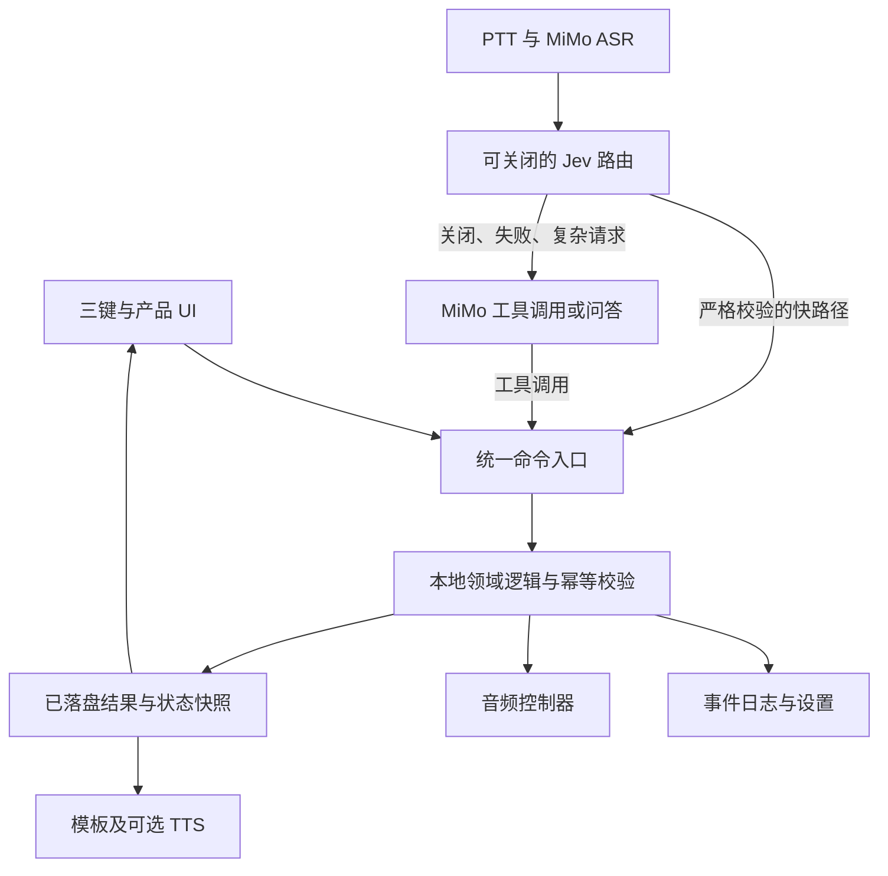

[English](xigua-implementation-plan.md) · **简体中文**

# 西瓜助手实施方案 v0.4（评审稿）

日期：2026-09-28。目标设备：FoloToy AI Passport，ESP32-C3、8 MB Flash、无 PSRAM、240×320 竖屏、三键、ES8311 音频。

建议把设备做成一个**离线能独立完成育儿记录、联网后可用语音操作的随身助手**。先交付可靠的本地产品，再接 MiMo，最后用实测决定是否启用 Jev 加速。全部功能位于同一套固件，开机直接进入西瓜助手。

本文件是方案，不代表功能已实现。用户本轮授权为结合规划包和既有会话做规划；包内“立即实施”等提示词及旧会话的刷机许可，不扩展为本轮实施、调用付费接口或刷机授权。下文数字未特别注明时均为建议预算或验收目标。

## 1. 依据与当前起点

- 输入包：`xigua_agent_solution_pack_v0.3_foundation.zip`；SHA-256：`7ea1f8e64bb9c11f455ad251030a8d65d2c8e7335d441002ce2a7b93492d8b81`。已审阅产品、基础能力、交互、数据、语音、路由、配置、Schema 和验收材料。
- 经验会话：`https://github.com/FoloToy/ai-passport/tree/main 我买了这个产品，去了…`，会话 ID `01a0e5b4-bdda-7250-b11b-a02d0d24b763`。以下实机结论来自该会话记录，本轮没有重新操作设备。
- 当前分支 `feature/xigua-childcare` 包含育儿助手实现。额度练习文件保持独立，不并入本应用；只提取其中的通用经验。
- 五个必需 Passport 技能已核实可用。本轮只做方案，不启动开发或刷机流程。
- 依据：[产品规格](../hardware-design/specifications.zh_CN.md)、[BSP 引脚](../../components/bsp/include/bsp_pins.h)、[AI 开发约束](../development/ai-guide.zh_CN.md)、[音频资源经验](../reference/phoenixzhc/network-audio-streaming-and-memory.zh_CN.md)。硬件冲突遵循仓库事实优先级，例如当前引脚头定义 LCD 时钟为 80 MHz，而概览仍写 40 MHz；不可据概览改驱动。

| 已有经验或证据 | 对本方案的直接要求 |
| --- | --- |
| 额度应用已刷入；日志确认启动、联网及 5 个账号查询 | 可复用构建、镜像核验、网络工作任务和 UI 状态快照模式；不等于语音或育儿功能已验证 |
| 曾报告黑屏，后续照片确认页面可见 | 显示初始化日志与真实画面分开验收；第一阶段必须验证中文、背光、真实按钮和离线页面 |
| 用户确认翻页可用，最新 OK 刷新反馈仍待现场确认 | 每个动作都显示受理、进行中、成功/失败；空列表也能进入设置、重试和返回 |
| 实际 HTTP 响应约 20.9 KB，超出原 16 KB 缓冲，改为 32 KB 后查询恢复 | 每种 API 单独规定响应、字段和解析内存上限；不能把“扩大到 32 KB”当作通用解决方案 |
| Windows 完整门禁受 actionlint 平台识别等问题阻塞；部分夹具及符号链接测试失败 | 环境门禁先单独修通并保留证据；固件构建成功不能替代 Host tests PASS |
| COM6 曾出现占用/枚举问题；最近固件写入及校验成功 | 每次刷机重新识别目标、核对镜像；限时日志观察结束释放端口，不把 COM6 固定写成产品条件 |
| 旧原型曾使用本地编译配置存放私用凭据 | 新产品优先运行时配置并分开管理 Wi-Fi、AI 与历史；忽略源码文件不意味着固件可公开分享 |

## 2. 产品范围与版本划分

采用规划包的单宝宝、单设备、个人使用定位，不增加账号系统、多人云同步或强制中转服务器。

| 版本 | 可交付体验 | 暂不纳入该版本 |
| --- | --- | --- |
| A：本地可用版 | 中文首页、三键、奶瓶/睡眠/尿布/洗澡/趴玩/计时器、今天、纠错撤销、设置、时间可信度、Wi-Fi 管理、3 个本地声音 | 语音理解、云音频 |
| B：语音可用版 | 按住说话，通过 MiMo 操作相同本地能力；辅食短备注、普通问答、语音回复 | Jev 自动执行 |
| C：路由优化版 | Jev off/shadow/active；逐技能测量后开放快路径 | 不以调用 Jev 本身作为完成标准 |
| D：可选扩展 | 腾讯云音频清单与流式播放；以后导出到 NAS/Hermes 异步汇总 | 不阻塞 A/B/C 交付 |

完整目标保留规划包的多住所 Wi-Fi、自动/手动时区和重启恢复。A 版内部拆小步骤交付，避免把庞大的基础能力一次合入。

明确排除：母乳左右侧计时、哄睡 Routine、洗澡倒计时、哭声病因判断、摄像头、本地大模型、实时链路依赖 Hermes、首版 OTA。普通知识回答不自动改变记录；医疗问题不提供诊断工具或自动医疗动作。

## 3. 使用体验和按键规则

首页保留 7 张卡：概览、喂奶、睡眠、尿布、声音、今天、更多。更多收纳辅食、洗澡、趴玩、计时器、Wi-Fi 和设置。概览主要呈现“上次奶量与时间、当前睡眠/计时、今天摘要”，保持大字、少信息。

```text
13:42       网络正常    82%

最近一次奶瓶
150 ml · 11:28
2 小时 14 分钟前

正在睡眠  00:47

上/下切换  OK 今天
按住 OK 说话
```

这是内容布局示意，实际需在 240×320 上检查字形与排版。状态栏时间未知时显示 `--:--`；电量读取失败显示未知；不凭电量上升推断正在充电。

| 操作 | 行为 |
| --- | --- |
| UP / DOWN 单击 | 卡片切换、选项移动；数值页按 ±10 ml 修改 |
| OK 单击 | 当前卡主动作；概览固定进入今天，避免随音频状态改变含义 |
| UP 长按 | 普通页面快速记奶，默认最近奶量；OK 保存 |
| DOWN 长按 | 返回/取消；顶层不执行破坏性动作 |
| OK 按住 | 语音；仅在普通页面可用，破坏性确认页禁用语音 |
| 熄屏后首次按键 | 整个按下到松开的手势只唤醒，随后再次按住才能录音 |
| 成功反馈 | 立即显示结果；5 秒撤销机会保留在首页提示条，不能随 1–2 秒成功页消失 |

声音卡：OK 进入详情，详情内 UP/DOWN 选轨、OK 播放/暂停、DOWN 长按返回。这样与首页切卡不冲突。撤销提示激活期间明确显示“OK 撤销”，并只作用于提示中的动作；修改是恢复旧值，新增是标记删除。

A 版辅食提供固定选项/无备注记录；B 版通过语音补充自由文本。A 版不承诺离线语音识别。奶量 10–400 ml 仅为初始输入范围，不是喂养建议；越界转人工复核，不能静默截断。

**PTT 接口必须先补齐：**当前 `bsp_button.h` 只有 PRESS/CLICK/DOUBLE/LONG，没有 RELEASE。BSP 应增加释放事件并验证底层回调；应用统一识别约 400 ms 长按，避免依赖另一个不同阈值的 LONG 事件。PRESS 触发音频 worker 的短预缓冲，短按松开丢弃；长按松开提交。长按后抑制 CLICK/DOUBLE；超时提交一次后必须等待释放才能再次开始。丢失释放事件时也有录音时长看门狗。测量音频唤起延迟，必要时用低成本预热减少丢首字。

## 4. 软件架构与资源所有权



建议应用模块放 `main/xigua/`：`app_controller`、`input`、`ui`、`domain`、`event_store`、`settings_store`、`time_service`、`wifi_manager`、`audio_manager`、`voice_session`、`providers`。名称是规划，不是已创建源码。引脚、共享 I2C、显示、音频、释放事件等可复用硬件接口留在 BSP。

- 控制任务串行接收命令，管理页面状态和领域状态；状态机与统计不依赖 LVGL/ESP-IDF，便于主机测试。
- 存储任务是唯一写入者，完成落盘后返回结果。UI 可立即显示“保存中”，只有成功后才能显示“记好了”。不要提前更新权威累计值。
- 音频控制器独占 codec/I2S；网络/音频/存储不能在按钮或 LVGL 回调里阻塞。外部线程访问 LVGL 必须加锁；优先让 UI 消费状态快照。
- 语音网络请求分阶段串行执行，释放 ASR 临时资源后再进入 LLM/TTS；首版不并行打开多个重型 TLS 会话。
- 页面退出销毁页面私有任务/定时器/回调；睡眠记录、Wi-Fi、计时和声音属于产品服务，切页不结束。服务不保存页面对象指针。
- 所有队列有长度上限，记录丢弃/超时；快速连按合并同类刷新，不无限排队。旧请求通过 session/generation ID 识别，取消后的回调不能修改新页面或执行命令。

统一执行协议建议：`command_id + session_id + action + target_event_id + expected_revision + args + source`。返回 `status + committed_event_id + revision + result + error_code`。同一个请求重试沿用 command_id；重复调用返回原结果。不能仅按“相同奶量、短时间”去重，因为用户可能真的记录两次。

模型只可调用白名单工具；本地再次校验字段类型、范围、状态和目标版本。撤销绑定明确目标，不能在等待模型期间误撤销用户刚按键新增的记录。多意图按步骤报告真实结果，不承诺跨音频与存储的原子事务。模型拿不到清空历史、改分区、导出凭据等管理工具。

## 5. 时间、数据与断电恢复

时间服务分开维护绝对时间可信度、时区来源及本次启动的单调时钟。时区提示只能提供地域规则，不能让未知绝对时间自动变成可信。

- 同一次开机的持续时间全部按 monotonic 计算，NTP 跳变不改时长。
- 首次校时可回填同一 boot 的未知事件，标记 reconstructed，并保存校时锚点与不确定性；不把回填值伪装为原始准确时间。
- 重启后，即使存有可信的开始时间，也需要当前时间重新可信才能计算跨重启时长。此前保留“进行中，时长待校时”；不能将上次保存的时刻当成现在。
- 无法还原的断电间隔标记 interrupted/unknown，允许后续人工修正。多个离线 boot 的 uptime 不相减。计时器到期状态未知时提示待确认，不凭旧倒计时重新启动。
- 今日统计按当前时区的本地日界线计算，睡眠跨日按区间交集分摊；时区变化重建索引，不改历史 UTC。无法归日的记录单列“时间待确认”，不计入精确今日合计。

原包事件 Schema 需要版本升级：增加 `schema_version`、`revision`、`command_id`、`start_boot_id/end_boot_id`、两端时间可信度、`duration_ms/duration_quality`、恢复状态、删除标记及撤销关联。开始与结束可能发生在不同启动中，单个 boot_id 无法表达。`payload` 必须按 type 约束，不能保留任意对象作为唯一校验。timer 的 deadline 和活动状态独立存储，不强行放入原来未包含 timer 的事件枚举。

推荐：NVS 保存设置、Known Wi-Fi 和小型恢复信息；专用事件分区使用经过验证的追加日志方案，例如基于 LittleFS 的有界日志。文件系统只是底层，应用仍需序号、长度、CRC、提交与重放规则；写一半只丢未确认记录。事件和活动状态在同一事务/日志记录表达，避免“开始睡眠已落盘、active 状态未落盘”的双写失配。

日志定期压缩时采用双代快照和原子切换；断电后选完整代，不自动格式化修复。保留修改/撤销语义和 command_id 去重记录。建议先验收 4,000 个事件、单条持久化帧不超过 256 B（含元数据；开放备注另设 UTF-8 字节上限）；若实现超预算，应调整编码/容量目标后再冻结格式。

存储满时停止新写并清楚提示，已有查询继续；不静默覆盖。提供通过 USB 主机工具导出结构化记录的维护通道，在已有记录时重新分区前必须能导出并校验；本地 UI 删除需明确确认。升级读取更高版本数据失败时保留原始数据，不恢复空库冒充成功。

## 6. 内存、Flash 与音频方案

16 kHz × 16 bit × 单声道约 32,000 B/s。8 秒 PCM 为 256,000 B，Base64 约 341,336 B，两份同时驻留已约 583 KiB，尚未计入 JSON、TLS、Wi-Fi、LVGL 和任务栈。规划包的 8 秒是体验目标，不能当成已可用的 RAM 方案。

**语音 PoC 从最长 3 秒开始。** 保留单一 96 KB PCM，流式写出 WAV header、分块 Base64 和 JSON 固定部分，不复制完整 Base64/JSON 请求。上传长度可预计算；分块写 HTTP body 不等于厂商支持边录边识别。3 秒方案也必须测堆峰值才能放行。若不能满足头部余量，进一步缩短或做经验证的压缩/专用临时存储 PoC；Flash 暂存需评估录音频率、磨损、音频丢帧及清理，不默认启用。经测试再逐步放宽到 4–5 秒及 8 秒；不能达到时在 UI 显示实际限制。

| 对象 | 初始预算/策略 |
| --- | --- |
| 录音 | 单一 3 秒 PCM 约 93.75 KiB；短预缓冲复用录音池 |
| 音频输出环形缓冲 | 8–16 KiB 起测；低水位告警、明确缓冲状态 |
| 网络临时块 | 2–4 KiB 应用块起测；TLS 内部峰值另行测量 |
| 结构化 JSON 响应 | 按接口设上限，初始目标 8–16 KiB；超过上限返回协议错误，不扩大到无限 |
| 显示 | 复用现有小块绘制；240×320 RGB565 全帧约 150 KiB，禁止轻率加全屏双缓冲 |
| 发布准入 | 关键阶段记录 minimum free heap、largest free block、栈余量；每个最大分配可满足且总空闲保留初始 32 KiB 目标，最终以压力测试修订 |

RAM 数字不能简单相加后宣称通过：录音、TLS、解析与播放的生命周期和连续可用块都要测。BLE 配网期间暂停语音重型请求，完成后释放 BLE；暂停后台云音频下载再进入 PTT。

建议产品分区草案如下，尚未修改 `partitions.csv`，实现前依据实际镜像和数据压力测试冻结。它只用于派生产品，不改变仓库的通用默认契约。

| 区域 | Offset | Size | 用途 |
| --- | --- | --- | --- |
| Bootloader / table / reserved | `0x000000` | `0x010000` | 引导与分区表区域 |
| nvs | `0x010000` | `0x010000` | 64 KiB 设置与网络资料 |
| phy_init | `0x020000` | `0x001000` | PHY 数据 |
| alignment reserve | `0x021000` | `0x00F000` | 对齐空隙 |
| factory | `0x030000` | `0x3D0000` | 3.8125 MiB，代码和字体 |
| events | `0x400000` | `0x280000` | 2.5 MiB 记录、索引、压缩余量 |
| audio_assets | `0x680000` | `0x180000` | 1.5 MiB 本地声音 |

末端为 `0x800000`。应用镜像目标不超过 factory 的 85%；若字体/网络库超标，应先按实测调整资源，不删数据区冒充通过。4,000 × 256 B × 两代约占 1.95 MiB，事件区余下约 0.55 MiB 用于索引、修改日志和文件系统开销；压缩触发必须早于余量耗尽。**4,000 条仍是待证明的容量目标，需用最大备注、连续修改和断电压缩测试验证，不能据表承诺。**

本地音频第一版优先低复杂度 PCM 短循环，3 个 10 秒、16 kHz/16 bit/mono 素材共约 0.916 MiB；这是容量计算，不证明雨声/海浪循环听感合格。素材采用自有/授权资源或程序生成噪声，验证循环接缝、响度与长播；缺素材时不可把空槽认作完成。后续再以 CPU/RAM PoC 决定是否使用 MP3/ADPCM。

音频优先级建议修订为：PTT > 计时到点提醒 > TTS > 背景声音。计时到点时屏幕即时提示；PTT 期间声音提示延至录音结束，避免污染录音，TTS 则可中断让路。用户手动停止背景声音后不能被旧语音会话自动恢复。夜间模式减少提示声音，但保持必要提醒可见；最大音量需由实机听感/测量确定，不把百分比等同安全声压。

## 7. Wi-Fi、时间与配置

Known Wi-Fi 上限 8 个，保存优先级、是否流量网络、自动连接、失败次数和时区提示。连接稳定时不因 RSSI 略强切换；掉线退避扫描，密码错误与 AP 不可见分开处理。

网络状态拆为：无线连接/IP、公共探测状态、AI 服务可达性。规划包默认的单个公网探测 URL 在用户网络中可能不可达，不能因此断定所有互联网不可用或阻止本可成功的 MiMo 请求。探测端点可配置，失败先显示“网络待确认”，DNS、TLS、401/429 等保留内部原因，普通页面只展示可操作提示。

新网络按 [BLUFI 指南](../development/engineering/wifi-provisioning.zh_CN.md) 抽取完整逻辑与安全协商，不能只搬一个 C 文件。首次成功后保存并释放 BLE；保存前完成最基本连接验证。确认现有配网端是否支持时区及 AI 凭据扩展；未证实前，手机时区作为可选来源，不能成为依赖。

时区默认 auto：手动覆盖 > 已保存网络提示 > 可配置 resolver 校正 > 最近可信缓存。无任何时区来源时明确待配置，可手选；不伪装定位成功。使用可支持 DST 的 POSIX TZ/经验证规则，单一 UTC offset 只够固定时区。resolver 未选定是部署待办，可失败而不影响记录。

个人原型优先用 USB 主机配置工具录入 AI endpoint/key/model；设备只显示是否配置、测试结果及掩码。运行时保存至独立设置命名空间，不需要用三键输入长密钥。默认直连 MiMo，不强制 NAS/电脑常驻；现有额度查询凭据、旧模型代理地址不自动拿来充当 MiMo/Jev 凭据。是否能通过旧代理调用所需模型需另测，文档不复制这些私有信息。

## 8. MiMo 接入与 Jev 放行策略

截至本次核对，官方列出了 `mimo-v2.5-asr`、支持函数调用的 `mimo-v2.6-flash` 与 `mimo-v2.5-tts`；可作为候选默认值，实际账号权限、额度与网络尚未测试。[MiMo 模型列表](https://mimo.mi.com/docs/zh-CN/quick-start/summary/model)

ASR 使用 WAV/MP3 的 Base64 输入，官方当前示例走 chat completions。规划包 ASR 链接已过时，正确页面在 audio 路径。[MiMo ASR](https://mimo.mi.com/docs/zh-CN/quick-start/usage-guide/audio/Speech-Recognition)

TTS 官方流式示例通过 SSE/JSON 中的 `delta.audio.data` 返回 Base64 音频，PCM 为 24 kHz、16 bit、单声道；**不能把 HTTP chunk 当裸 PCM 直接交 I2S**。需增量处理 SSE、JSON、Base64，再进入有界 PCM 队列。HTTP chunk 与 SSE/音频块边界不必一致。先测 BSP 的 16↔24 kHz 切换及暂停恢复，再决定是否重采样。[MiMo TTS](https://mimo.mi.com/docs/zh-CN/quick-start/usage-guide/audio/speech-synthesis-v2.5)

基础链路：PTT → ASR → MiMo 工具调用 → 本地校验/提交 → 固定结果文案 → 可选 TTS。记录成功后 TTS 失败，仍显示已保存，绝不重做写入。模型幻觉式“已记好”不能覆盖本地执行结果。普通问答不给写工具；限制回答长度和工具轮次，首版最多 2 轮工具往返，超出提示分次表达。

Jev 当前 OpenAPI 确认 `/v1/models`、`/v1/systemone` 与 choice/confidence/probabilities；没有实测低延迟保证。[TypeSafe OpenAPI](https://api.typesafe.ai/openapi.json)

- 默认 `off`，B 版稳定后进入 `shadow`；这调整了包内示例的默认 shadow，避免首版多一个强依赖。
- Shadow 在设备顺序执行：先完成真实 MiMo 操作，再用冻结的请求前状态做 Jev 对照；空闲且内存足够才采样，不延迟主路径，不重复执行。需要排除热连接/时间顺序偏差，另做交替顺序的录制样本实验；PC 可承担离线评估。
- Active 初期只放行只读查询、明确本地音频操作和无歧义状态切换。奶量新增随后放行；纠错、撤销、取消计时先要求目标确认/保留 MiMo 路径。MiMo 路径同样受本地目标与确认规则约束。
- 路由和技能均需置信度阈值、概率合法性/候选集检查；技能 top2 margin；完整参数解析、状态版本及 allowlist 校验。0.94/0.20 和 1200 ms 只作初始实验配置。
- 否定、条件、回述、提问、多意图和两个数值的纠错不能靠“抽出一个数字”执行。例如“不是 150，是 170”“别记 150”“如果喝了 150 呢”必须有专门规则或回退。ASR 已误识别成另一条合法命令时本地范围校验无法发现，需展示识别结果和撤销入口。
- 至少准备 200 条人工标注样本，包含真实口音/噪音 ASR、负例和重试；MiMo 与 Jev 一致不等于正确。逐技能报告误执行、覆盖率和 p50/p95。
- 建议放行门槛：评估集中直接写入误执行为 0；真机端到端 p95 不劣于 baseline、快路径 p50 至少改善 20%。这是小样本工程门槛，不是可靠性保证；未达到则保持 off/shadow，产品仍可完整使用。

一次请求预算统一管理；Jev 超时只回退，不多层重试。ASR/LLM/TTS 各自超时、取消与连接清理；401 提示配置，429/5xx 有限退避；超限/异常 JSON 不进入执行层。成功反馈延迟与首个可播放语音延迟分开统计，不能只拿 Jev API 耗时证明体验变快。

## 9. 中文、素材与故障反馈

固定 UI 使用可复现的中文子集和图标资产，按页面逐字校验；不能复用 demo 菜单外壳或假定 Montserrat 支持中文。动态 ASR/回复/辅食/SSID 使用额外的常用字覆盖策略和明确的缺字替代提示，UTF-8 按字符边界截断；原文数据仍保留。缺字时可保留语音反馈，不能静默删字冒充正确显示。字体 Flash 预算纳入 factory 实测。[中文字体指南](../development/engineering/lvgl-chinese-fonts.zh_CN.md)

动作状态统一为受理、进行中、成功、失败/可重试、取消。诊断页显示固件 build ID、数据版本、最近错误、堆和栈余量；用户页给“保存失败，请重试”“时间待校准”等具体反馈。网络失败时仍能切卡、返回设置和记录。

设置覆盖声音、显示、Wi-Fi、时间、AI、设备信息、重启及分项重置。删除记录、清除凭据、清除网络、恢复出厂互不混淆；管理动作都走明确 UI 确认，恢复出厂长按确认期间禁用 PTT。

## 10. 里程碑与验收门槛

工期仅供单人开发排期：A 约 9–15 个有效开发日，B 再 5–8 日，C 再 2–4 日；不含等待素材、账号、现场反馈和云服务问题。实际以阶段验收重新估算，D 独立排期。

| 阶段 | 工作与产物 | 进入下一阶段的证据 |
| --- | --- | --- |
| M0，1–2 日 | 独立开发基线；门禁环境；中文状态页；真实按钮事件观测；内存基线 | 离线启动目标 ≤3 s；中文和每键实测；Host/Build 门禁可复现，否则记录并修复阻塞 |
| M1，3–5 日 | 命令/数据/时间模型；奶瓶、睡眠、尿布、洗澡、趴玩、计时、今天、撤销 | 同命令重试只写一次；断电恢复、未知时间、跨日统计、满存储、修改撤销主机测试与设备测试 |
| M2，3–5 日 | 8 个 Wi-Fi、BLUFI、时间/时区、设置、亮度/熄屏、状态恢复 | 两个 AP 切换；错密码、互联网探测失败、服务单独失败；熄屏首键不误操作；配网反复进退无泄漏 |
| M3，2–3 日 | 3 个本地声音、音量、循环、提醒仲裁 | 连播 ≥20 min，同时翻页/记奶/计时；无明显爆音，停止后资源回收。A 版验收 |
| M4，5–8 日 | RELEASE/PTT、3 秒录音 PoC、ASR/工具/TTS、辅食备注、取消/错误恢复 | 包中 10 条语音主场景；100 次会话不重复落盘、无持续内存下降；16↔24 kHz 与边界分块验证。B 版验收 |
| M5，2–4 日 | Jev 样本、shadow 报表、按技能 active | 人工 gold label、误执行/覆盖/p50/p95 与基线对照；失败无感回退。C 版条件验收 |
| M6，另排 | 云 manifest、codec PoC、流式播放；以后异步同步 | 断网/取消/切轨和缓冲可恢复；无任意 URL 播放；不会阻塞本地操作 |

全阶段共用验收：按钮反馈目标 ≤150 ms，保存成功提示目标 ≤500 ms（实际闪存延迟实测）；网络忙时仍能操作；取消/退出不访问失效 UI；批量断电注入覆盖日志写入和压缩；至少一轮 8 小时混合运行。续航与低功耗没有实测前不承诺小时数，熄屏也不等于芯片深睡。

每个固件迭代运行仓库完整门禁，交付 merged image、匹配 ELF、manifest 和哈希，并分别报告 Build/Host tests/Device tests。刷机在用户授权后进行；新分区会改变原 NVS/应用位置，必须先交代数据影响。普通后续升级优先使用已验证、布局兼容的分段镜像保留记录，不能把 `0x0` 合并刷写当成保数据操作。

## 11. 开始实施前的少量待定项

| 项目 | 方案默认 | 何时必须解决 |
| --- | --- | --- |
| 是否保留额度查询 | 独立保留旧工程，不并入助手 | 如需并入，另行评估导航与网络资源 |
| MiMo/Jev 账号与模型权限 | 私用设备直连，运行时配置；Jev 可关闭 | M4/M5 的实连测试前 |
| 3 段音频与字体授权 | 程序噪声/自有授权素材，声音可替换 | M0 字体、M3 音频验收前 |
| 8 秒录音 | 目标保留，3 秒起步实测 | M4 容量证据后决定开放范围 |
| resolver 与配网端扩展 | 自动模式带缓存/手动兜底 | M2 完整验收前 |
| 新分区、数据容量与导出 | 按本方案 PoC，实测冻结 | 第一版有真实记录前 |

建议下一轮只实施 M0–M1，形成“离线中文界面 + 三键可靠记录 + 掉电恢复”的首个可刷验证版本；通过真机验收后继续 M2–M3。这样能尽早发现设备上的真实问题，又不缩减完整产品目标。

## 12. 当前实现快照

本分支现在已经在方案基础上加入第一版可刷写育儿固件。中文三键应用包含本地喂养、大小便、睡眠、洗澡、趴玩、计时、今天和设置页面；AI 动作使用校验过的 JSON 协议并保存到有界本地事件队列。设置页提供 BLUFI 蓝牙配网、时区选择、亮度和清除 Wi‑Fi 凭据。固件启动时自动启动 BLUFI 服务，自动连接已保存的凭据，获取 IP 后启动 SNTP。固定界面字形由霞鹜文楷生成，并已按源码字集检查覆盖率。

```text
Build: PASS（ESP-IDF 5.5.3，合并镜像已校验）
Host tests: PASS（仓库检查与固件布局测试）
Device tests: NOT RUN（尝试刷写时系统未发现 COM6）
Unverified: 配网小程序实测、真机中文渲染、Wi‑Fi 凭据、音频/PTT、真实 AI 服务、
            延迟、断电恢复和续航
```
